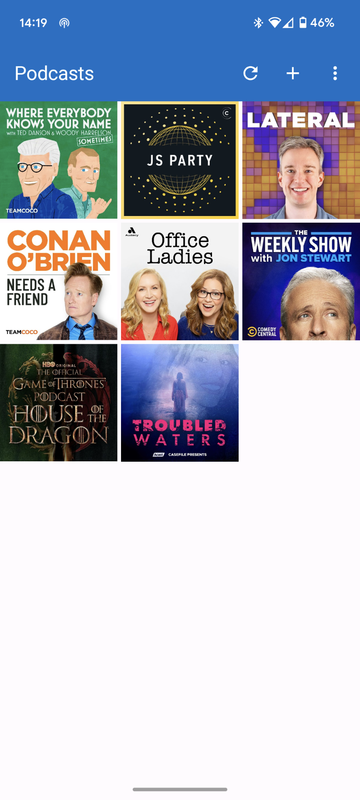
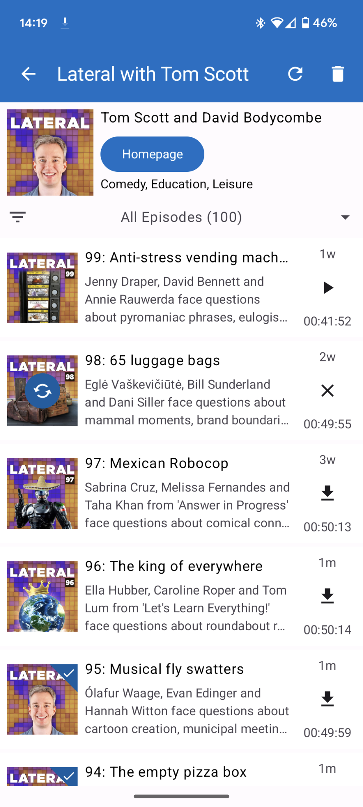
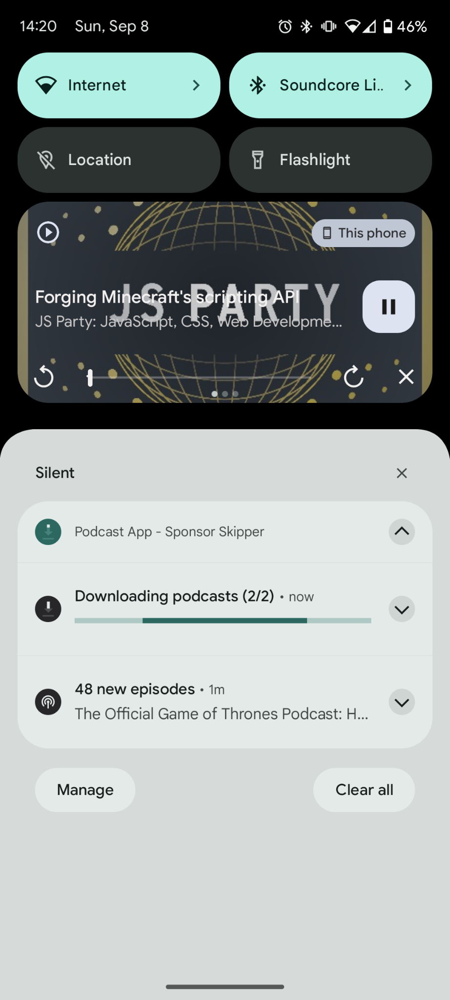
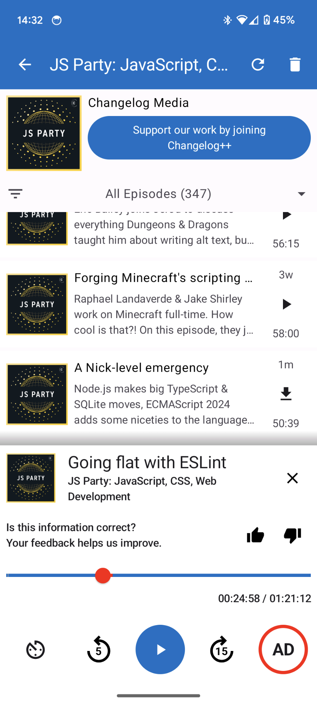

<h2 align="center"><b>Podcast App - Sponsor Skipper - Backend</b></h2>

**Podcast App - Sponsor Skipper** is an Android App, designed to enhance your podcast listening experience by allowing you to skip
over sponsor segments effortlessly. With community-driven contributions, you can enjoy uninterrupted
content, making your podcast time more enjoyable.

How does it work?

Users can tag unwanted sponsor segments and advertisements. These tagged segments will be sent to the backend, that processes the data and distributes it to all other users. The segments can be rated by other users to improve the quality of the overall system.

# Table of Contents

1. [Screenshots](#screenshots)
2. [Getting Started](#getting-started)
    1. [Prerequisites](#prerequisites)
    2. [Setup the Project](#setup-the-project)
    3. [Start the Backend](#start-the-backend)
    4. [Manage Users and Data](#manage-users-and-data)
3. [Project Overview](#project-overview)

# Screenshots

    
    
    
    

# Getting Started

## Prerequisites

This Android application is developed with [Android Studio Koala | 2024.1.1 Patch 1](https://developer.android.com/studio) using Kotlin and Gradle.

Make sure you have the required Android SDKs and JDK installed.
The Project was developed using the JetBrains Runtime 17.0.11 (JDK 17).

## Start the App

1. Open the project with Android Studio.

2. Let Android Studio sync the Gradle files and download dependencies.

3. Click the Run button to build and run the app on an emulator or a physical device.

# Project Overview

Here's an overview of the project structure:

-   `app/src/main/java/de/devbeyer/podcast_sponsorskipper/`: Contains the main source code for the application.
-   `app/src/main/AndroidManifest.xml`: The Android manifest file, defining essential app information and components.
-   `app/build.gradle.kts`: The build configuration file for Gradle, managing dependencies and build settings.

The application project follows a three-layer architecture:

1. **Presentation Layer**: Manages the UI components and user interactions using ViewModels, located in the `ui/` directory.

2. **Data Layer**: Handles data operations such as fetching, and storing. It includes repositories and data sources in the `data/` directory.

3. **Domain Layer**: Contains business logic and use cases that coordinate data flow between the data and presentation layers. The `domain/` directory holds this logic.

The project uses Hilt for dependency injection to provide dependencies in a modular and scalable way. Hilt's modules are located in `di/module/`. The `service/` directory contains the background service that handles media playback. Utility classes and helper functions used across different layers of the app are located in the `utils/` directory.

`PodcastApplication.kt` is the main application class that initializes components when the app starts. It is the entrypoint for the app.
